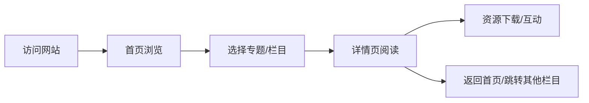
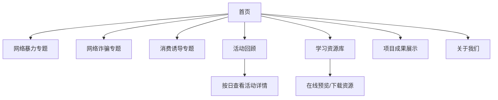

# 法润青苗——未成年人网络安全普法平台 产品需求文档（PRD）

## 1. 产品概述

《法润青苗——未成年人网络安全普法平台》是四川大学"法暖万家·守护朝夕"团队专属线上官方平台，集项目展示、普法科普、活动纪实、资源沉淀、长效运营于一体。

- **核心目标**：服务暑期社会实践成果落地、赛事材料申报、社区家校宣传，长期作为社区未成年人网络普法公益阵地
- **目标用户**：9-16岁未成年人、学生家长、社区工作人员、学校教师、项目指导老师、高校团委及赛事评审人员
- **产品价值**：单次实践、长效复用，打造可持续、可复用的校级志愿服务品牌平台

## 2. 核心功能

### 2.1 用户角色

| 角色 | 访问方式 | 核心权限 |
|------|----------|----------|
| 访客用户 | 直接访问 | 浏览所有公开内容、下载学习资源 |
| 管理员 | 后台登录 | 内容管理、资源上传、数据统计 |

### 2.2 功能模块

1. **首页**：项目简介、轮播海报、时间轴、最新动态、三大专题入口、成果概览
2. **网络暴力专题**：定义形式、案例解析、法律法规、应对方法、求助渠道、行为倡议
3. **网络诈骗专题**：诈骗类型、话术拆解、防范技巧、处置流程、反诈口诀
4. **消费诱导专题**：算法陷阱、直播打赏、游戏充值、理性消费、替代方案
5. **活动回顾**：五日实践活动分日展示、现场实拍、互动记录、作品展示
6. **学习资源库**：课件PPT、口袋书、科普手册、法律解读、反诈卡片、公约模板
7. **项目成果**：调研报告、数据统计、宣传推文、视频纪实、团队心得
8. **关于我们**：项目背景、团队介绍、成员分工、指导老师、合作单位

### 2.3 页面详情

| 页面名称 | 模块名称 | 功能描述 |
|----------|----------|----------|
| 首页 | Hero轮播区 | 主题海报自动轮播，3-5张，支持手动切换 |
| 首页 | 项目简介 | 核心价值主张，项目定位与目标 |
| 首页 | 实践时间轴 | 五天实践活动时间线展示，交互动效 |
| 首页 | 最新动态 | 活动快讯、新闻速览卡片列表 |
| 首页 | 三大专题入口 | 卡片式导航，悬停动效 |
| 首页 | 成果数据概览 | 数据可视化展示（参与人次、覆盖社区等） |
| 网络暴力专题 | 知识科普区 | 定义、形式、危害图文展示 |
| 网络暴力专题 | 案例解析区 | 真实案例卡片，点击展开详情 |
| 网络暴力专题 | 法律条文区 | 相关法律法规条文展示 |
| 网络暴力专题 | 应对指南区 | 方法步骤、求助渠道信息 |
| 网络诈骗专题 | 诈骗类型区 | 高发类型分类展示（图标+说明） |
| 网络诈骗专题 | 话术拆解区 | 常见诈骗手法揭秘 |
| 网络诈骗专题 | 防范技巧区 | 实用技巧、口诀记忆 |
| 网络诈骗专题 | 处置流程区 | 被骗后标准化操作步骤 |
| 消费诱导专题 | 陷阱识别区 | 算法陷阱、信息茧房原理解析 |
| 消费诱导专题 | 典型案例区 | 直播打赏、游戏充值案例 |
| 消费诱导专题 | 理性消费区 | 消费观培养方法 |
| 消费诱导专题 | 替代方案区 | 无屏幕趣味生活建议 |
| 活动回顾 | 日期选择器 | 五天活动切换导航 |
| 活动回顾 | 每日流程 | 活动时间线、流程介绍 |
| 活动回顾 | 图片画廊 | 现场实拍照片网格展示 |
| 活动回顾 | 作品展示 | 青少年原创作品展示 |
| 学习资源库 | 分类筛选 | 按资源类型分类浏览 |
| 学习资源库 | 资源卡片 | 封面+标题+简介+下载按钮 |
| 学习资源库 | 在线预览 | PDF/文档在线查看 |
| 项目成果 | 数据统计 | 实践数据可视化展示 |
| 项目成果 | 报告文档 | 调研报告、总结材料 |
| 项目成果 | 媒体报道 | 宣传推文链接、截图展示 |
| 项目成果 | 视频专区 | Vlog、采访视频播放 |
| 关于我们 | 项目背景 | 立项依据、初心愿景 |
| 关于我们 | 团队介绍 | 团队合照、成员卡片 |
| 关于我们 | 指导老师 | 导师信息展示 |
| 关于我们 | 合作单位 | 高校、社区、企业logo墙 |

## 3. 核心流程

### 用户浏览主流程

### 内容浏览流程

## 4. 用户界面设计

### 4.1 设计风格

**整体定位**：简洁清新、活泼治愈、专业易懂，摒弃严肃政务风，贴合青少年审美

**色彩系统**：
- **主色调-法治蓝**：#2563EB（深蓝，代表法治、专业、信任）
- **辅助色-成长绿**：#10B981（绿色，代表成长、健康、希望）
- **纯净白**：#FFFFFF / #F8FAFC（背景色，干净清爽）
- **点缀色**：#F59E0B（暖橙，用于强调、互动元素）
- **文字色**：#1E293B（深灰蓝，主文字）/ #64748B（中灰，辅助文字）

**字体选择**：
- 标题字体："Noto Sans SC" / "PingFang SC" 现代无衬线，清晰易读
- 正文字体：系统默认无衬线字体栈
- 字号体系：12px / 14px / 16px / 18px / 24px / 32px / 48px

**按钮风格**：
- 圆角设计（rounded-xl），友好亲和
- 主按钮：法治蓝渐变，悬停上浮效果
- 次按钮：白底蓝边，简洁大方
- 图标按钮：圆形背景，微动效

**布局风格**：
- 顶部固定导航栏，毛玻璃效果
- 卡片式内容展示，圆角柔和阴影
- 大量留白，呼吸感强
- 栅格系统，响应式适配

**图标风格**：
- Lucide 图标库，线性风格
- 卡通插画点缀（使用 emoji 和 CSS 图形）
- 专题页面配主题图标

### 4.2 页面设计概览

| 页面名称 | 模块名称 | UI 元素 |
|----------|----------|---------|
| 首页 | Hero轮播 | 渐变背景、大标题、轮播动画、指示器 |
| 首页 | 专题卡片 | 三色卡片（蓝/绿/橙）、图标、悬停上浮 |
| 首页 | 时间轴 | 竖向时间线、圆点标记、连线动画 |
| 首页 | 数据概览 | 数字动效、图标、统计卡片 |
| 专题页 | 知识卡片 | 折叠面板、图标引导、图文并茂 |
| 专题页 | 案例展示 | 卡片网格、标签分类、详情弹窗 |
| 活动回顾 | 日期导航 | 横向标签、选中态高亮 |
| 活动回顾 | 图片画廊 | 瀑布流/网格布局、灯箱预览 |
| 资源库 | 资源卡片 | 封面缩略图、文件类型图标、下载按钮 |
| 关于我们 | 成员卡片 | 头像圆形、姓名、分工、简介 |

### 4.3 响应式设计

- **设计原则**：Desktop-first，移动端自适应
- **断点设置**：
  - 桌面端：≥ 1024px（完整布局）
  - 平板端：768px - 1023px（两列布局）
  - 移动端：< 768px（单列布局，汉堡菜单）
- **触摸优化**：移动端按钮尺寸≥44px，间距适配手指操作
- **导航适配**：移动端收起为侧边抽屉菜单

### 4.4 动效与交互

- **页面入场**：元素渐入上移，stagger 错峰动画
- **卡片悬停**：y轴-4px位移 + 阴影加深
- **滚动触发**：时间轴、数据数字随滚动动画
- **轮播切换**：平滑淡入淡出
- **导航滚动**：滚动时导航栏背景虚化加深
