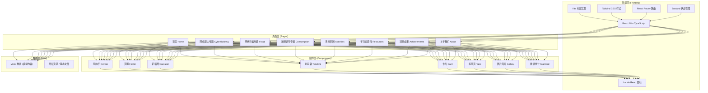

# 法润青苗——未成年人网络安全普法平台 技术架构文档

## 1. 架构设计



## 2. 技术描述

- **前端框架**：React 18 + TypeScript
- **构建工具**：Vite 5（快速开发、热更新）
- **样式方案**：Tailwind CSS 3（原子化CSS，高效开发）
- **路由管理**：React Router DOM v6
- **状态管理**：Zustand（轻量级状态管理）
- **图标库**：Lucide React（线性图标，美观统一）
- **后端服务**：无（纯前端静态站点，使用 Mock 数据）
- **部署方式**：静态文件部署（可部署到 Vercel / Netlify / 静态服务器）

> 注：当前版本为纯前端展示站点，使用模拟数据。后续如需后台管理系统，可扩展 Express + 数据库方案。

## 3. 路由定义

| 路由路径 | 页面名称 | 说明 |
|----------|----------|------|
| `/` | 首页 | 项目概览、轮播、专题入口、时间轴、数据 |
| `/cyberbullying` | 网络暴力专题 | 网络暴力科普、案例、法律、应对 |
| `/fraud` | 网络诈骗专题 | 诈骗类型、防范技巧、处置流程 |
| `/consumption` | 消费诱导专题 | 消费陷阱、理性消费、替代方案 |
| `/activities` | 活动回顾 | 五日活动展示、图片、作品 |
| `/resources` | 学习资源库 | 资源分类、下载、预览 |
| `/achievements` | 项目成果 | 数据统计、报告、视频、报道 |
| `/about` | 关于我们 | 项目背景、团队、合作单位 |

## 4. 数据模型（Mock 数据）

### 4.1 数据结构定义

```typescript
// 轮播图数据
interface Banner {
  id: string;
  title: string;
  subtitle: string;
  imageUrl: string;
  link?: string;
}

// 专题数据
interface Topic {
  id: string;
  title: string;
  description: string;
  icon: string;
  color: string;
  route: string;
}

// 案例数据
interface Case {
  id: string;
  title: string;
  category: string;
  summary: string;
  content: string;
  tags: string[];
}

// 活动数据
interface Activity {
  day: number;
  date: string;
  title: string;
  description: string;
  schedule: TimeLineItem[];
  images: string[];
  works: WorkItem[];
}

// 时间轴项
interface TimeLineItem {
  time: string;
  title: string;
  description: string;
}

// 资源数据
interface Resource {
  id: string;
  title: string;
  category: string;
  type: 'ppt' | 'pdf' | 'doc' | 'video' | 'image';
  description: string;
  fileSize: string;
  downloadUrl: string;
  coverUrl: string;
}

// 团队成员
interface TeamMember {
  id: string;
  name: string;
  role: string;
  avatar: string;
  description: string;
}

// 成果数据
interface Achievement {
  id: string;
  title: string;
  type: 'report' | 'media' | 'video' | 'data';
  value?: string;
  description: string;
  link?: string;
}
```

### 4.2 数据文件组织

```
src/
  data/
    banners.ts          # 轮播图数据
    topics.ts           # 专题数据
    cyberbullying.ts    # 网络暴力专题数据
    fraud.ts            # 网络诈骗专题数据
    consumption.ts      # 消费诱导专题数据
    activities.ts       # 活动回顾数据
    resources.ts        # 学习资源数据
    achievements.ts     # 项目成果数据
    team.ts             # 团队信息数据
```

## 5. 项目目录结构

```
├── src/
│   ├── components/        # 公共组件
│   │   ├── layout/       # 布局组件（Navbar, Footer）
│   │   ├── common/       # 通用组件（Card, Button, Modal）
│   │   └── home/         # 首页组件
│   ├── pages/            # 页面组件
│   │   ├── Home.tsx
│   │   ├── Cyberbullying.tsx
│   │   ├── Fraud.tsx
│   │   ├── Consumption.tsx
│   │   ├── Activities.tsx
│   │   ├── Resources.tsx
│   │   ├── Achievements.tsx
│   │   └── About.tsx
│   ├── data/             # Mock 数据
│   ├── hooks/            # 自定义 Hooks
│   ├── utils/            # 工具函数
│   ├── App.tsx
│   ├── main.tsx
│   └── index.css
├── public/               # 静态资源
├── index.html
├── package.json
├── vite.config.ts
├── tailwind.config.js
├── tsconfig.json
└── postcss.config.js
```

## 6. 技术选型说明

### 为什么选择 React + TypeScript？
- 组件化开发，代码复用性高
- TypeScript 类型安全，减少运行时错误
- 生态丰富，社区活跃，长期维护有保障

### 为什么选择 Tailwind CSS？
- 原子化CSS，开发效率高
- 设计系统统一，便于维护
- 响应式设计便捷
- 构建体积优化（按需生成）

### 为什么是纯前端？
- 初版以展示为主，内容相对固定
- 部署简单，维护成本低
- 后续可根据需要扩展后台管理系统
- 静态站点访问速度快，SEO友好
